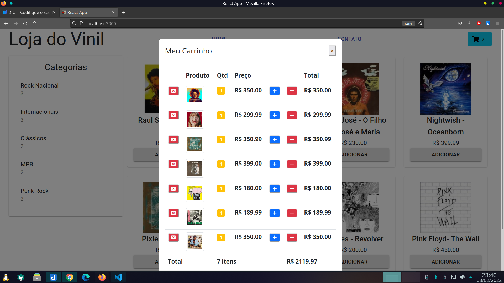

# Frontend para ecommerce 💽

Projeto que demonstra um frontend de um ecommerce de discos de vinil, desenvolvido em react. Orientação da especialista
[Nathally Souza]().

### Ferramentas utilizadas 🔧

- Bootstrap
- React
- Material UI
- JavaScript

### Resultado 🤩

Após instalar as dependências, pode-se iniciar o projeto na porta 3000, com os comandos  

```bash
yarn install
yarn start
```  

  

😜 Projeto concluído em 09/02/2022.


